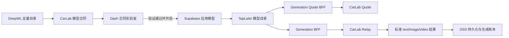

# DeepWL 契约驱动模型管理设计

## 1. 目标

本设计把 DeepWL 模型从“多处硬编码”迁移为一套由 CarLab API 管理、Dash 验证发布、TapLater 动态消费的版本化模型合同。

第一阶段覆盖 DeepWL 全量目录，但不把未验证模型直接暴露给 TapLater：

1. DeepWL 全量模型同步到 Dash，默认状态为草稿。
2. 每个模型必须完成字段、素材、请求、返回和价格验证。
3. 只有绑定了可调度合同并通过发布门禁的模型，Dash 才允许开启。
4. TapLater 只显示 Dash 已开启且处于 `production` 的应用模型。
5. TapLater 恢复原有模型、比例、清晰度、时长和数量弹层，不展示通用自由填写表单。
6. 模型菜单显示模型品牌图标、模型名和模型描述，不显示 DeepWL 等渠道商文字。
7. 所有价格计算由服务端完成，前端只展示 Quote 结果。

## 2. 非目标

- 不把所有 DeepWL 模型未经真实验证就一次性发布到 TapLater。
- 不在 TapLater 重新维护一份模型价格、字段映射或返回解析规则。
- 不允许 Dash 保存任意 JavaScript、表达式或可执行模板。
- 不删除现有 New API 基础模型价格、模型倍率和分组倍率体系。
- 不用金牌、银牌、铜牌替代 TapLater 的本地用户倍率。
- 不在 TapLater 模型菜单展示 API 渠道商名称。

## 3. 术语与权威边界

| 概念 | 示例 | 权威系统 |
| --- | --- | --- |
| 模型供应商 | Google、OpenAI、xAI、Alibaba | CarLab 模型元数据与模型合同 |
| API 渠道商 | DeepWL | CarLab 渠道与路由元数据 |
| 网关模型 | `deepwl/gemini-3.5-flash` | CarLab API |
| 模型合同 | 字段、素材、请求、价格倍率、返回格式 | CarLab API |
| 应用模型 | TapLater 是否显示、排序和推荐 | Supabase `app_models` |
| CarLab 结算组 | 金牌、银牌、铜牌 | New API 分组倍率 |
| TapLater 用户组 | 基地、KOL、普通、企业 | Supabase 用户组倍率 |
| 最终积分 | CarLab Quote 经过 TapLater 用户倍率后的整数积分 | Generation BFF |

CarLab API 是模型能力、参数倍率和网关价格的唯一真相源。Dash 是管理与验证界面，不建立第二套合同。TapLater 只消费已发布的有效合同。

## 4. 总体数据流



模型关闭后的行为：

- 新目录请求不再返回该应用模型。
- 已保存节点保留模型名和历史参数，但显示“模型已停用”。
- 新 Quote 和新生成请求由 BFF 拒绝。
- 已提交的异步任务继续轮询和结算，不能因关闭开关丢失结果。

## 5. 版本化模型合同

### 5.1 Profile 与 Binding

现有通用 Profile 继续描述一个操作族的最低公共能力，例如：

- `text.chat.basic`
- `image.generate.basic`
- `image.generate.chat`
- `video.generate.basic`

模型 Binding 负责具体模型差异。现有 `overrides` JSON 改为受服务端校验的强结构合同，不允许任意字段。

Binding 增加：

- `contract_version`：每次影响运行行为的保存自动递增。
- `contract_hash`：由 Profile 版本与标准化 Binding 合同计算。

CarLab 保存合同时只负责结构校验。草稿、字段已验证、价格已对账和可发布等运行验证状态，由 Dash 根据 Supabase 中同一 `contract_hash` 的 `app_model_verifications` 计算，不能在 Binding 中再保存第二份验证状态。

Supabase 应用模型固定记录 `profile_version`、`contract_version` 和 `contract_hash`。BFF 调用时必须与 CarLab 当前合同一致；不一致返回 409 并要求 Dash 重新验证发布。

### 5.2 合同结构

```json
{
  "contract_version": 4,
  "branding": {
    "icon_key": "openai",
    "description": "图像生成与编辑，支持多种比例和分辨率"
  },
  "input_schema": {
    "type": "object",
    "additionalProperties": false,
    "properties": {
      "prompt": { "type": "string", "minLength": 1 },
      "aspect_ratio": {
        "type": "string",
        "enum": ["1:1", "16:9", "9:16"],
        "default": "1:1"
      },
      "resolution": {
        "type": "string",
        "enum": ["1K", "2K", "4K"],
        "default": "1K"
      },
      "n": { "type": "integer", "enum": [1, 2, 4], "default": 1 }
    },
    "required": ["prompt"]
  },
  "ui_schema": {
    "placements": {
      "prompt": "prompt",
      "aspect_ratio": "footer",
      "resolution": "footer",
      "n": "batch"
    },
    "widgets": {
      "aspect_ratio": "menu",
      "resolution": "menu",
      "n": "segmented"
    },
    "labels": {
      "aspect_ratio": "比例",
      "resolution": "清晰度",
      "n": "数量"
    }
  },
  "material_schema": {
    "image": {
      "max_items": 4,
      "mime_types": ["image/png", "image/jpeg", "image/webp"],
      "max_size_mb": 15,
      "request_field": "image_url",
      "transport": "url"
    }
  },
  "request_contract": {
    "adapter": "openai-image",
    "field_map": {
      "aspect_ratio": "aspect_ratio",
      "resolution": "size",
      "n": "n"
    },
    "coercions": {}
  },
  "pricing_rule": {
    "mode": "newapi-base-with-parameter-multipliers",
    "multipliers": [
      {
        "field": "resolution",
        "values": { "1K": 1, "2K": 1.5, "4K": 2 }
      }
    ],
    "quantity_field": "n"
  },
  "response_contract": "openai-image-data-v1"
}
```

### 5.3 UI 插槽规则

TapLater 只渲染注册过的组件类型：

| Placement | 用途 |
| --- | --- |
| `prompt` | 节点已有提示词编辑器，不由动态表单重复渲染 |
| `footer` | 比例、分辨率、时长、质量等底部弹层 |
| `batch` | 生成数量分段控件或步进器 |
| `advanced` | 温度、Top P、Max Tokens 等高级参数弹层 |
| `material` | 图片、视频、音频素材入口 |
| `hidden` | 服务端常量或不允许用户直接编辑的字段 |

枚举字段必须使用菜单、分段控件、切换或步进器。自由文本控件只允许用于合同明确声明的文本字段。未知的必填字段或未知 widget 会使模型无法通过发布门禁。

必填错误只在用户触碰字段或提交后显示，节点初次打开不能立即显示 `prompt 为必填项`。

## 6. 素材上传与请求映射

素材合同必须明确：

- 允许的素材类型。
- 最小/最大数量。
- MIME 类型和单文件大小。
- 视频/音频总时长限制。
- 发送给上游的目标字段。
- 传输方式：URL、base64 或 multipart。

TapLater 上传流程：

1. 根据合同限制文件选择器。
2. 客户端执行数量、类型和大小预检。
3. 上传自有 OSS，获得稳定 URL。
4. Generation BFF 再次校验素材数量和 URL。
5. 请求适配器按 `request_contract` 映射到 DeepWL 字段。

`request_contract.adapter` 必须来自后端注册表，例如 `openai-chat`、`openai-image`、`openai-video`。字段重命名与有限类型转换可以配置，但禁止执行脚本或任意表达式。

## 7. 返回合同

返回解析继续采用命名注册表，不在 Dash 保存任意解析代码。第一阶段至少覆盖：

- OpenAI Chat 文本。
- Chat Markdown 图片链接。
- OpenAI Images URL/base64。
- OpenAI Video 异步任务。
- DeepWL 已验证的其他同步或异步结构。

Generation BFF 统一输出：

```json
{
  "text": "可选文字结果",
  "media": {
    "url": "可选媒体 URL",
    "b64_json": "可选 base64"
  },
  "raw": {}
}
```

图片和视频成功后继续进入现有 OSS 持久化链路。上游时效 URL 不能作为画布永久资产。

## 8. 价格与积分

### 8.1 权威公式

```text
New API 模型基础价
× 模型参数倍率（分辨率、时长、质量、数量等）
× CarLab 结算组倍率
× TapLater 本地用户倍率
× 15
= 最终积分
```

基础价继续来自 New API 现有模型价格/模型倍率配置。模型合同只补充参数倍率，不建立第二份基础价格。

CarLab Quote 与真实 Relay 必须调用同一个参数规则计算器，输出：

- 基础价或 token 估算。
- 每个参数倍率。
- CarLab 有效组及组倍率。
- `pricing_version`。
- `contract_hash`。
- 预计 CarLab 金额。

### 8.2 Generation Quote BFF

TapLater 新增认证端点 `/api/generation-quote`。它与实际生成共享同一上下文加载和校验逻辑，返回：

- 单份预计积分。
- 批量总积分。
- CarLab Quote 摘要。
- TapLater 用户倍率。
- 合同与价格版本。

前端不得自行乘分辨率、时长或用户倍率。

如果 `n` 是一个上游请求字段，CarLab 按合同一次计算实际数量倍率。如果模型不支持 `n`，Generation BFF 以多个独立幂等请求执行，Quote 总价必须按每个请求分别取整后求和，与实际账本一致。

固定价格媒体模型必须精确预扣。Token 模型继续保守预扣并按真实 usage 退款差额，不允许在完成后执行无上限补扣。

Quote 后若 `pricing_version` 或 `contract_hash` 发生变化，生成请求返回 409，客户端刷新 Quote 后才能重试。

## 9. CarLab 金银铜结算组

保留现有 `default` 组用于兼容，不直接删除。

新增组键与显示名称：

| Group key | 显示名称 | 初始倍率 | 用途 |
| --- | --- | --- | --- |
| `gold` | 金牌 | 1.0 | Superseed 专用与优先 OEM |
| `silver` | 银牌 | 1.2 | 后续 OEM |
| `bronze` | 铜牌 | 1.5 | 后续 OEM |

CarLab API 用户 `ID=2` 调整为 `gold`，Superseed 服务 Token 绑定 `gold`。Superseed 应用模型的 `carlab_group` 从 `default` 迁移到 `gold`，Generation BFF 必须验证 Quote 的 `effective_group=gold`。

银牌与铜牌先建立组和倍率，不自动签发生产 Token。后续管理员可在 CarLab API 面板调整倍率。

TapLater 的基地、KOL、普通和企业倍率继续独立计算。

## 10. Dash 管理工作流

### 10.1 DeepWL 全量目录

Dash 提供以下筛选：

- API 渠道商固定为 DeepWL 或选择全部。
- 文字、图片、视频等模型类型。
- 草稿、字段已验证、价格已对账、可发布、已发布。
- 模型供应商品牌。

模型列表显示品牌图标、模型名、模型描述、类型、合同状态、价格状态、发布开关和调试入口。

模型描述来自 CarLab 合同的 `branding.description`，录入时必须依据模型供应商或上游正式文档；不能由渠道商名称或模型 ID 自动猜测。

### 10.2 合同实验室

逐模型调试抽屉包括：

1. 字段与 TapLater 插槽。
2. 素材上传限制。
3. 请求字段映射与最终请求预览。
4. 参数价格倍率与 Quote 拆解。
5. 返回解析器与标准化结果预览。
6. 真实上传、生成、轮询和实际扣费对账。

主要编辑界面使用菜单、表格、开关和数值控件。原始 JSON 只作为只读高级检查器，不要求管理员手写 JSON。

真实调试记录写入 `app_model_verifications`，至少包含：

- 应用模型 ID。
- 合同 hash。
- 验证类型。
- 成功/失败状态。
- 脱敏请求摘要。
- Quote、实际扣费和差异。
- 标准化结果摘要。
- 执行时间和管理员。

### 10.3 发布门禁

发布开关只有在同一合同 hash 下满足以下条件时可用：

- Profile 与 Binding 可调度。
- 必填字段都有受支持的 TapLater widget。
- 素材合同完整。
- 请求适配器存在。
- 返回合同存在。
- 基础价格存在。
- 参数价格规则通过校验。
- 真实生成成功。
- Quote 与实际扣费在允许误差内一致。

## 11. TapLater 节点交互

### 11.1 通用规则

- 保留原有节点布局和底部控件。
- 删除当前节点内整块 `DynamicModelControls` 通用表单展示。
- 动态合同只为原有弹层提供选项、默认值、禁用状态和字段映射。
- 节点打开模型菜单时强制刷新目录，Dash 开关无需等待前端长期缓存。
- 模型菜单显示模型品牌图标、模型名和模型描述，不显示 DeepWL 等渠道商文字。
- 节点收起状态只显示品牌图标和模型名。
- 生成按钮显示 `/api/generation-quote` 返回的真实积分，不显示 `Quote` 占位文字。

### 11.2 文字节点

- 模型弹层。
- 高级参数弹层：Temperature、Top P、Max Tokens 等合同允许字段。
- 默认隐藏高级字段，不占用节点主体空间。

### 11.3 图片节点

- 模型、比例、清晰度/分辨率、质量和数量控件。
- 控件只在当前模型合同声明时出现。
- 素材入口按 image-to-image 合同决定数量和类型。

### 11.4 视频节点

- 模型、比例、时长、分辨率和数量控件。
- 文生视频与图生视频共用节点，根据素材合同决定是否允许参考图。
- 异步结果继续使用统一状态接口轮询。

## 12. 数据库与 API 影响

### 12.1 CarLab API

- `model_operation_bindings` 增加合同版本和 hash。
- `overrides` 采用受验证的合同结构。
- Catalog/Profile API 返回有效合同、品牌和描述。
- Quote API 返回合同 hash、参数倍率和完整价格拆解。
- Relay 与 Quote 共用参数倍率计算器。
- 管理 API 支持保存草稿、验证合同和查询版本。

所有迁移必须兼容 SQLite、MySQL 和 PostgreSQL。

### 12.2 Supabase

- `gateway_model_snapshots` 增加合同版本、hash、品牌图标键和描述。
- `app_models` 增加固定合同版本与 hash。
- 新增 `app_model_verifications` 保存发布门禁证据。
- 现有 `enabled` 与 `rollout_stage` 继续作为 TapLater 发布开关。

### 12.3 TapLater API

- 增强 `/api/model-catalog`。
- 新增 `/api/generation-quote`。
- `/api/generations` 与 Quote 共享参数、素材、OEM、组和合同版本校验。
- `/api/generation-status` 继续处理异步终态和账本。

## 13. DeepWL 落地顺序

1. 建立合同校验、价格规则和金银铜组。
2. 建立 Dash 合同实验室与发布门禁。
3. 恢复 TapLater 原生弹层并接入 Quote。
4. 迁移当前已验证 DeepWL 文字合同族。
5. 迁移 DeepWL 图片合同族并逐个验证分辨率/质量价格。
6. 迁移 DeepWL 视频合同族并逐个验证时长/分辨率价格。
7. 同步其余 DeepWL 模型为草稿，按合同族批量复用后逐模型验证。
8. 只有验证完成的模型才打开 Dash 发布开关。

“全量接入”表示全量进入可管理目录，不表示全量未经验证即可生产调用。

## 14. 错误处理

- 合同字段非法：保存草稿失败并定位到具体字段。
- 未注册 widget/适配器/返回合同：发布门禁失败。
- 模型关闭：新 Quote 与新生成返回 `app_model_not_available`。
- 合同版本变化：返回 `app_model_contract_changed`。
- 价格版本变化：返回 `carlab_pricing_changed`。
- Quote 无法计算：生成按钮禁用，不使用旧硬编码价格兜底。
- 上游失败：保持现有幂等退款。
- 返回无法解析：任务失败、退款并保存脱敏原始摘要供 Dash 调试。
- OSS 持久化失败：保留当前会话结果并显示持久化失败状态，不伪装为永久成功。

## 15. 测试与验收

### 15.1 CarLab API

- 合同结构验证与跨数据库迁移测试。
- 每种 widget、素材规则、字段映射和类型转换测试。
- 分辨率、时长、质量、数量倍率测试。
- Quote 与 Relay 使用同一规则的回归测试。
- `gold/silver/bronze` 分组倍率与 Token 有效组测试。

### 15.2 Dash

- 发布门禁每个失败原因可见。
- 合同保存后版本递增且旧验证失效。
- 上传样例、请求预览、真实生成、返回解析和价格对账可逐项执行。
- 发布开关只影响目标应用模型。

### 15.3 TapLater

- 文字、图片、视频节点不再显示整块动态填写表单。
- 模型弹层显示品牌图标、模型名和描述，不显示渠道商。
- 不同模型只显示各自允许的比例、分辨率、时长、质量和数量。
- 上传数量、类型和大小与合同一致。
- Quote 积分与最终账本一致。
- 关闭模型后目录、旧节点和新生成行为符合设计。
- 图文视频同步/异步结果正确写回节点并持久化。

### 15.4 云端验收

按文字、图片、视频顺序执行：

1. 临时用户与积分。
2. 目录可见性。
3. Quote 拆解。
4. 真实生成与重复幂等。
5. 上传和返回标准化。
6. Quote、实际扣费和账本对账。
7. 临时数据清理。

## 16. 发布与回滚

- CarLab API 先部署合同与 Quote 能力，但不改变已有发布模型。
- Dash 再部署合同实验室和门禁。
- TapLater 使用独立功能开关启用新目录控件与 Quote。
- DeepWL 按合同族逐步打开，不一次性切换全量生产流量。
- 回滚时关闭 TapLater 新控件和 Generation BFF 类型开关，并关闭受影响应用模型。
- 合同、验证记录和加法迁移保留，避免丢失审计证据。

## 17. 已确认决策

- 采用契约驱动方案。
- DeepWL 全量进入 Dash，只有验证模型可发布。
- CarLab 负责所有参数价格倍率。
- 金银铜属于 CarLab/OEM 结算组，TapLater 本地倍率继续保留。
- 分辨率、时长和数量等会影响价格。
- TapLater 恢复原生弹层，不展示通用自由填写框。
- 模型列表显示品牌图标、模型名和描述，不显示渠道商文字。
