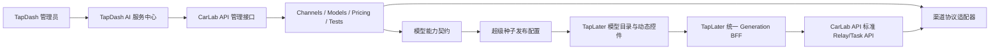

# Superseed Dash 与 TapLater 模型能力契约设计

## 1. 结论

超级种子的模型体系不应继续以“模型 ID + provider 分支 + 前端硬编码参数”扩展。目标架构应拆成两个相互独立的契约：

1. **模型能力契约（Model Capability Contract）**：描述某个模型对超级种子公开什么操作、字段、选项、素材限制、响应类型和测试样例。它是 API 文档、TapDash 配置预览和 TapLater 动态控件的共同数据源。
2. **渠道协议适配（Channel Runtime Adapter）**：描述 CarLab API 如何把标准请求转换成上游请求，如何提交、轮询、解析结果和结算计费。它只在 CarLab API 内执行，TapLater 不感知上游渠道协议。

OpenAPI 继续描述端点级公共协议，但不能单独承担模型能力契约。当前 `docs/openapi/relay.json` 的 `/v1/images/generations` 仍以 Qwen 图片请求为例，而不同图片、视频模型的枚举、素材限制和异步状态机并不相同。直接让 TapLater 解析 OpenAPI 或上游自然语言文档来拼请求，仍会把上游差异扩散回前端。

最终原则是：

```text
一份模型能力契约
→ 生成模型文档
→ 驱动 TapDash 配置与预览
→ 驱动 TapLater 模型筛选和控件

CarLab API 渠道适配器
→ 请求转换
→ 上游提交与轮询
→ 响应归一化
→ 计费与日志
```

## 2. 当前功能问题

### 2.1 TapDash

- `CarLab/TapDash/api/admin-models.js` 维护一份独立硬编码目录，与 CarLab API 动态目录重复。
- `ModelsView.vue` 在浏览器加载全表并做本地筛选，仅支持单条开关、单条编辑和 JSON 导入。
- `content.js` 逐条循环 upsert，缺少服务端分页、选择全部筛选结果、批量状态变更和异步任务进度。
- `model_settings.provider` 实际混用了 API 渠道商含义，没有独立的模型供应商和渠道商字段。
- `api_url`、`api_key_env` 等字段继续让超级种子承担上游 API 配置，与 CarLab API 的渠道中心职责冲突。
- `StatusView.vue`、`health-probe.js`、`health-status.js` 分别硬编码 Provider 列表，新增渠道后必须多点同步。
- `FallbackConfigView.vue` 只支持图片模型，并再次硬编码图片模型列表。
- “套餐定价”只管理充值包，模型成本、动态参数价格和 CarLab API 计费没有统一视图。
- “用户分组”是超级种子积分倍率，而 CarLab API 的 `group` 是计费与路由组；当前 UI 没有清晰区分或映射关系。

### 2.2 TapLater

模型差异目前散落在至少七个位置：

| 位置 | 当前职责 |
| --- | --- |
| `src/services/_models.ts` | 模型列表、渠道、静态能力、清晰度、比例 |
| `ImageNode.vue` / `VideoNode.vue` / `TextNode.vue` | 控件、条件、兼容性和模型切换规则 |
| `src/lib/materialValidation.ts` | 素材格式、尺寸、数量和时长限制 |
| `src/stores/creditsStore.ts` | 模型价格和参数化计费 |
| `src/services/generate*.ts` | Provider 分发、请求体和响应解析 |
| `api/images/generate.js` / `_providerPoll.js` | 服务端提交、轮询、结果镜像和状态写回 |
| `api/proxy.js` / `vercel.json` | 上游地址、凭据和代理路由 |

新增模型即使只增加一个清晰度选项，也可能同时修改模型目录、节点、积分、请求映射、代理、轮询和结果解析。视频节点还以模型 ID 判断 Seedance、Kling、Vidu、Grok、Omni、Veo 等模式，已经无法通过继续增加条件分支稳定扩展。

### 2.3 CarLab API 已有可复用能力

CarLab API 已经具备大部分底层能力：

- Channel 列表、服务端分页、筛选、批量启停和标签。
- 渠道 Base URL、Key/Multi-Key、模型列表、模型映射、计费路由组、优先级和权重。
- 上游模型抓取、余额查询、渠道测试、自动禁用和上游变更检查。
- 模型供应商、API 渠道商、模型类型、来源、标签和端点元数据。
- `param_override` 请求字段转换和 `header_override`。
- 文本、图片、音频等 Relay Adapter，以及视频异步 Task Adapter。
- Task Adapter 的请求校验、请求转换、提交、轮询、结果归一化和动态计费钩子。
- Billing Expression 和任务 Other Ratios，可按请求参数计算差异价格。
- 持久化 `system_tasks`，可承载渠道测试、模型批量测试和目录同步任务。

这些能力应作为 TapDash 的管理后端，不应在 Supabase 复制第二份渠道配置。

## 3. 目标架构



### 3.1 数据所有权

| 数据 | 权威系统 | TapDash 行为 |
| --- | --- | --- |
| API 渠道、Key、Base URL、协议类型 | CarLab API | 列表、编辑和调用管理接口 |
| 模型供应商、渠道商、模型类型和来源 | CarLab API | 展示、筛选、同步 |
| 模型路由、映射、优先级、权重、group | CarLab API | 展示和维护 |
| 上游请求/响应/轮询适配 | CarLab API | 只选择或编辑适配配置 |
| 模型能力契约 | CarLab API | 编辑、预览、测试和发布 |
| 超级种子是否展示、排序、推荐、集合 | Supabase | 权威维护 |
| 超级种子用户层级和积分策略 | Supabase | 权威维护并绑定 CarLab group |
| 画布、节点、业务任务和本地积分流水 | Supabase | 权威维护 |
| CarLab 请求日志和真实渠道消费 | CarLab API | 通过 request/task ID 关联展示 |

## 4. 模型能力契约

### 4.1 为什么不能只用 OpenAPI

OpenAPI 擅长描述“这个端点接收什么结构”，但不能经济地描述 1589 个模型分别支持哪些枚举、素材槽位和条件组合。将每个模型做成 `oneOf` 会让规范巨大且难以维护；上游文档也经常只有自然语言页面，没有可靠的机器格式。

推荐采用：

- OpenAPI：端点级协议和 SDK 参考。
- JSON Schema：模型参数的数据类型、枚举、范围、默认值和条件规则。
- UI Schema：控件类型、顺序、分组和显示方式。
- Material Schema：图片、视频、音频素材槽位和校验规则。
- Runtime Adapter：CarLab API 内部的请求/响应适配。

上游 OpenAPI 可以作为导入向导的预填来源，但必须经过管理员确认后形成正式模型能力契约。

### 4.2 契约结构

建议新增可复用 `model_operation_profiles`，模型通过绑定表引用 profile，而不是给每个模型复制整份 JSON。一个模型可以同时绑定多个操作，例如文字理解、图片生成和图片编辑。

```json
{
  "profile_key": "video.seedance-2",
  "version": 3,
  "operation": "video.generate",
  "endpoint_type": "video-generation",
  "execution": {
    "mode": "async-task",
    "response_contract": "video-task-v1"
  },
  "input_schema": {
    "type": "object",
    "properties": {
      "mode": {
        "type": "string",
        "enum": ["reference", "first_last", "first_only"],
        "default": "reference"
      },
      "aspect_ratio": {
        "type": "string",
        "enum": ["auto", "16:9", "4:3", "1:1", "3:4", "9:16", "21:9"],
        "default": "16:9"
      },
      "resolution": {
        "type": "string",
        "enum": ["480p", "720p", "1080p"],
        "default": "720p"
      },
      "duration": {
        "type": "integer",
        "enum": [4, 5, 6, 8, 10, 12, 15],
        "default": 10
      },
      "generate_audio": {
        "type": "boolean",
        "default": true
      }
    },
    "required": ["mode", "resolution", "duration"]
  },
  "ui_schema": {
    "order": ["mode", "aspect_ratio", "resolution", "duration", "generate_audio"],
    "widgets": {
      "mode": "segmented",
      "aspect_ratio": "aspect-ratio",
      "resolution": "segmented",
      "duration": "step-options",
      "generate_audio": "toggle"
    }
  },
  "material_schema": {
    "image": { "max_items": 9, "roles": ["reference", "first_frame", "last_frame"] },
    "video": { "max_items": 3, "max_total_duration": 15.2 },
    "audio": { "max_items": 3, "max_total_duration": 15 }
  },
  "smoke_test": {
    "prompt": "生成一个简短的镜头运动测试",
    "parameters": { "mode": "reference", "resolution": "480p", "duration": 4 }
  }
}
```

实际契约还应包含：

- `profile_version` 和发布状态。
- 中英文标题、说明和字段文案。
- 条件可见性与跨字段约束。
- 输入素材格式、大小、尺寸、时长和数量。
- 是否支持流式、同步或异步任务。
- 统一响应契约引用。
- 计费相关参数名，但不在前端复制价格公式。
- 自动测试 payload 和最低成本测试档。

### 4.3 Profile 继承和覆盖

1589 个模型不应维护 1589 份完全独立 Schema。建议采用：

```text
共享 Profile 模板
+ Model Binding
+ 少量 Model Override
```

例如多个 Seedance 路由共享 `video.seedance-2`，Mini 版本只覆盖 `resolution.enum`，渠道命名空间模型只覆盖展示信息和测试样例。Profile 修改必须发布新版本，已经进入生产的 App Model 固定引用具体版本，避免后台编辑后直接改变历史画布行为。

## 5. 渠道协议适配

### 5.1 三档适配策略

| 档位 | 适用情况 | 实现方式 |
| --- | --- | --- |
| 标准协议 | OpenAI、Anthropic、Gemini 等兼容协议 | 现有 New API Relay Adapter |
| 声明式适配 | 简单 JSON 同步接口或标准 submit/poll 接口 | 配置请求模板、GJSON 结果选择器和状态映射 |
| 代码适配 | 签名鉴权、multipart、SSE、素材预处理、多端点分流、复杂结算 | Go Task/Relay Adapter |

不能把所有协议强行做成 JSON 模板。Seedance 首尾帧、Wuyinkeji 私有异步接口、SSE 结果、上游文件上传、真实用量结算等仍应使用代码适配器。声明式适配器主要减少简单新渠道的重复代码。

### 5.2 声明式适配器建议字段

- 请求：method、path、content type、模板、字段映射、固定字段。
- 鉴权：复用 Channel Key、header override 和 query auth。
- 提交响应：task ID、同步 URL 或 Base64 的 GJSON 路径。
- 轮询：path 模板、间隔、状态路径、成功/失败状态映射。
- 结果：URL、Base64、错误码和错误消息路径。
- 计费：提交参数到 Other Ratios 的映射；复杂计费仍走 Adapter 或 Billing Expression。
- 调试：保存标准请求、转换后请求和归一化响应预览。

声明式配置属于 CarLab API Channel/Adapter，不进入 TapLater。

## 6. 文档体系

同一份模型能力契约应产生三类文档：

1. Scalar OpenAPI Reference：标准端点、认证、通用请求和响应。
2. 模型目录页：每个模型支持的操作、字段、可选值、素材规则、价格模式和渠道信息。
3. 接入指南：文本、图片、视频、异步任务、错误处理和 OEM 集成。

建议在 OpenAPI operation 中增加 `x-carlab-profile-url`，指向对应的动态模型 Profile API，但不把所有模型枚举展开到 OpenAPI 文件。模型详情页和 TapLater 都读取同一 Profile API。

文档编辑流程不是“写完 Markdown 再让程序解析”，而是：

```text
维护 Profile 结构化数据
→ 自动生成字段表、请求示例和测试表单
→ 人工补充说明性 Markdown
```

## 7. TapDash 信息架构调整

当前“内容运营 → 模型管理”承载不了 API 平台和应用发布两种职责。建议新增一级菜单“AI 服务”：

| 页面 | 权威数据 | 主要功能 |
| --- | --- | --- |
| API 渠道 | CarLab API | 渠道列表、测试、余额、同步、启停和编辑 |
| 网关模型 | CarLab API | 供应商、渠道商、端点、路由、价格和 Profile 绑定 |
| 能力模板 | CarLab API | JSON Schema、UI Schema、素材规则、文档和版本 |
| 应用模型 | Supabase + CarLab 快照 | 超级种子发布、排序、推荐、集合和灰度 |
| 测试中心 | 两端 | 渠道测试、模型测试、App E2E 测试和历史结果 |
| 生成记录 | Supabase + CarLab 日志 | 用户任务、网关请求、实际渠道和费用关联 |
| 路由与兜底 | 两端 | CarLab 路由策略与超级种子产品级回退 |

### 7.1 API 渠道页

复用 New API 的操作模型，不复制其 React 页面代码。TapDash 使用 Vue 实现，数据和操作直接调用 CarLab API：

- 服务端分页和 URL 可恢复筛选。
- 状态、API 渠道商、协议类型、计费与路由组、标签、模型筛选。
- 列：状态、名称、渠道商、协议、模型数、group、优先级、权重、延迟、余额、最后测试。
- 行操作：测试、更新余额、抓取模型、查看模型差异、启停、复制和编辑。
- 批量操作：启用、停用、标签、测试和同步模型。
- 编辑抽屉：基础信息、凭据、多 Key、模型、模型映射、group、优先级、权重、参数覆盖和请求头覆盖。

TapDash 不保存 Channel Key、Base URL 或模型映射副本。所有写操作直接落 CarLab API 数据库。

### 7.2 网关模型页

以 CarLab API 模型页为基础增加：

- `model_type` 服务端筛选。
- Profile 是否绑定、版本和验证状态。
- 可路由、已核价、已测试、已发布到超级种子四个独立状态。
- 批量绑定 Profile、批量进入应用候选、批量触发最低成本测试。
- 模型详情侧栏同时展示 Model Provider、API Channel Provider、Bound Channel，避免再次混用 Provider。

### 7.3 能力模板页

- 模板列表和版本状态：Draft、Tested、Published、Retired。
- 可视化字段编辑器：类型、枚举、范围、默认值和必填。
- UI 预览：使用 TapLater 同一套 Widget Registry 渲染。
- 素材槽位编辑器：图片、视频、音频、数量、格式、尺寸和角色。
- 请求预览：显示标准 CarLab 请求，不显示上游密钥。
- 响应预览：显示统一响应契约。
- 文档预览和自动测试样例。

### 7.4 应用模型页

`model_settings` 应收缩为应用发布层，不再保存上游 API URL 或 Key 环境变量。建议字段：

- `gateway_model_id`
- `operation`
- `profile_key` / `profile_version`
- `display_name`
- `enabled`
- `rollout_stage`
- `recommended`
- `sort_order`
- `collection_ids`
- `local_ui_overrides`
- `fallback_app_model_id`
- `last_test_status` / `last_tested_at`

应用模型只能从已经可路由、已核价、已绑定 Profile 的网关模型中选择。

### 7.5 监控、计费和用户分组

- `StatusView` 不再维护硬编码 Provider；渠道状态直接来自 CarLab API。
- `HealthView` 保留为超级种子业务调用健康，增加 gateway request ID 和实际网关模型。
- 当前“套餐定价”改名“充值套餐”；另增“模型计费”读取 CarLab API 定价和 Quote 结果。
- 超级种子用户层级明确显示两个字段：本地积分倍率和绑定的 CarLab“计费与路由组”。
- 模型集合是应用发布概念，不使用 `group` 命名。

## 8. TapLater 改造

### 8.1 新的客户端结构

建议新增：

- `modelCatalogStore`：加载已发布模型、Profile 和版本。
- `DynamicModelControls.vue`：读取 Schema 渲染字段。
- `ModelParameterWidgetRegistry`：select、segmented、toggle、slider、stepper、aspect-ratio、media-slot 等控件。
- `modelEligibility`：根据节点操作、素材连接、Profile 和用户集合筛选模型。
- `generationClient`：只调用超级种子统一 Generation BFF。
- `modelProfileValidator`：使用 JSON Schema 校验参数和素材。

### 8.2 模型筛选

模型可选范围应由以下条件计算：

```text
应用已发布
∩ Profile 已发布并通过测试
∩ operation 与节点一致
∩ 当前连接素材满足 material schema
∩ 当前用户/模型集合允许
∩ CarLab API 当前可路由且已核价
```

`supportsImageInput`、`supportsVideoInput`、`isSeedance`、`isKling` 等模型 ID 判断逐步替换为 Profile 能力。不能满足当前素材的模型保留在列表中但显示具体不兼容原因，避免用户不知道模型为什么消失。

### 8.3 动态控件

JSON Schema 负责数据约束，UI Schema 负责展示。复杂交互通过有限的 Widget Plugin 扩展，而不是继续按模型 ID 写分支：

- `first-last-frame`：首帧/尾帧素材角色。
- `reference-media-mode`：全能参考、首尾帧、首帧模式。
- `template-id`：Package 模板选择。
- `authorized-asset`：人物素材 Asset ID。

当出现新的“交互类型”时增加一个 Widget；当只是新的模型枚举或限制时只修改 Profile。

### 8.4 节点数据兼容

新节点建议保存：

```json
{
  "model": "deepwl/example-model",
  "operation": "video.generate",
  "profile_key": "video.seedance-2",
  "profile_version": 3,
  "parameters": {
    "mode": "reference",
    "aspect_ratio": "16:9",
    "resolution": "720p",
    "duration": 10,
    "generate_audio": true
  }
}
```

现有工作区必须迁移旧字段：`aspectRatio`、`quality`、`duration`、`seedanceResolution`、`seedanceMode`、`klingSoundMode` 等。加载旧画布时转换到 `parameters`，保存时写新格式；迁移完成前保留旧字段读取兼容。`TapCanvas.vue` 的剪贴板清洗逻辑也必须允许 `parameters` 和 Profile 版本，否则复制节点会丢失动态字段。

## 9. 统一 Generation BFF

TapLater 节点不应直接调用 CarLab API，也不应继续根据 Provider 选择前端或服务端路径。新增超级种子服务端统一入口：

```text
POST /api/generations
GET  /api/generations/:id
```

提交结构包含：

- `app_model_id`
- `operation`
- `parameters`
- `inputs`（prompt、图片、视频、音频素材）
- `workspace_id` / `node_id`

BFF 负责：

1. 解析 App Model 到 Gateway Model 和 Profile 版本。
2. 调用 CarLab Quote 获取权威估算。
3. 在服务端预扣超级种子积分。
4. 按 Profile endpoint type 调用 CarLab 标准端点。
5. 保存 `ai_tasks`、CarLab request ID 和 gateway task ID。
6. 同步结果直接落库；异步任务由统一轮询器推进。
7. 失败按业务任务状态退款，不由浏览器猜测。
8. 结果统一镜像 OSS 并写回工作区节点。

CarLab API 负责 Provider 和上游协议，BFF 负责超级种子用户、积分、画布和 OSS。两者边界清晰后，`generateImage.ts`、`generateVideo.ts`、`_apiConstants.ts` 和 `api/proxy.js` 的 Provider 分支可以按阶段退役。

## 10. 动态计费

TapLater 不再保存模型成本表。CarLab API 新增 Quote 接口，输入模型、operation 和参数，复用实际 Relay/Task Adapter 的计费估算逻辑：

```text
POST /api/user/models/quote
```

返回至少包含：

- 生效的计费与路由组。
- billing mode 和 pricing version。
- 参数倍率和匹配档位。
- 估算网关配额/金额。
- Quote 版本或短期 ID。

TapDash 和 TapLater 都使用 Quote 展示预计积分。真正扣费必须在 BFF 服务端重新计算，前端价格仅用于显示。文本模型如无法准确预估输出 token，应明确显示估算条件或采用超级种子业务固定价，而不是伪装成精确成本。

## 11. 测试体系

测试分成三个层级：

| 层级 | 执行位置 | 证明内容 |
| --- | --- | --- |
| Channel Test | CarLab API | 凭据、网络和协议基础可用 |
| Model Contract Test | CarLab API | 指定模型 + Profile 请求可以完成并归一化响应 |
| App E2E Test | TapDash/TapLater BFF | 发布配置、积分、任务、OSS 和画布写回完整可用 |

CarLab API 已有 `system_tasks`，应新增 `model_contract_test` 任务类型，支持选中模型或筛选结果批量测试，记录进度、成功率、延迟、费用和错误。视频模型使用 Profile 的最低成本测试样例，默认不执行全目录高成本测试。

TapDash 测试中心应提供：

- 动态表单手工测试。
- 标准请求和归一化响应预览。
- 测试样例保存与版本绑定。
- 按 Profile、模型类型、渠道商和发布状态批量测试。
- Gateway 与 App E2E 结果对照。
- 未测试、通过、降级、失败、不兼容状态筛选。

模型不能因为一次偶发失败直接退出生产；状态切换应由测试策略和人工发布动作决定。

## 12. 推荐数据表

### 12.1 CarLab API

- `model_operation_profiles`
- `model_operation_profile_versions`
- `model_operation_bindings`
- `declarative_adapter_profiles`（后续阶段）
- `model_contract_test_results`

为了继续兼容 SQLite、MySQL 和 PostgreSQL，Schema、UI 和 Adapter 配置使用 TEXT 保存 JSON，由 Go 结构体校验；不使用数据库专属 JSON 查询作为核心逻辑。

### 12.2 Supabase

- `gateway_model_snapshots`
- `app_models`
- `model_collections`
- `model_collection_members`
- `app_model_test_runs`
- `app_model_test_results`

`gateway_model_snapshots` 只保存同步快照。同步时缺失的模型先标记 `stale`，不能直接删除本地发布记录。

## 13. 分阶段实施

### 阶段 0：契约基础，不改生产调用

- CarLab Model 增加 Profile 数据结构、版本和目录 API。
- 为现有超级种子模型建立首批 text/image/video Profile。
- 增加 Token 模型类型权限和 `/api/user/models/catalog`。
- 增加 Quote API。
- 补齐 OpenAPI 中视频 endpoint template 和模型 Profile 链接。

验收：Profile 能生成文档和动态表单，尚不切换 TapLater 调用。

### 阶段 1：TapDash AI 服务中心

- 新增 API 渠道、网关模型、能力模板、应用模型和测试中心路由。
- 接入 CarLab 管理接口，完成服务端分页和常用渠道操作。
- 建立 CarLab 目录快照和应用发布表。
- 替换硬编码 Provider 监控和图片兜底模型列表。

验收：管理员可从一个 Dash 查看渠道、模型、Profile、发布和测试状态。

### 阶段 2：TapLater 目录与动态控件

- 新增模型目录 Store、Profile 校验和动态 Widget Registry。
- 节点模型列表改为服务端发布目录。
- 节点数据增加 `parameters` 和 Profile 版本。
- 完成旧工作区字段迁移和复制/粘贴兼容。

验收：新增同类模型只绑定 Profile 和发布，不修改节点组件。

### 阶段 3：统一 Generation BFF

- 新增统一生成和查询端点。
- 先迁移文本，再迁移图片，最后迁移视频。
- 每类保留旧路径 feature flag 和回滚开关。
- 迁移 `ai_tasks` 到 gateway request/task ID。

验收：TapLater 不再按 Provider 选请求路径；模型差异由 Profile 与 CarLab Adapter 承担。

### 阶段 4：协议适配与 OEM

- 增加声明式同步/异步适配器。
- 将适合的 Wuyinkeji/DeepWL 私有协议迁入 CarLab Adapter。
- 模型集合绑定 OEM、用户层级和 CarLab group。
- 完成 Gateway 消费和超级种子积分对账。

## 14. 功能验收标准

1. 在 CarLab API 新增一个标准 OpenAI 图片模型，只需绑定 Profile、价格和渠道即可在 Dash 成为应用候选。
2. 修改某模型的清晰度或比例选项，只发布新 Profile 版本，不修改 TapLater 节点源码。
3. 新增一个简单异步视频 API，可通过声明式适配器完成 submit、poll 和结果归一化。
4. 新增复杂协议时只增加 CarLab Adapter 和 Profile，不增加 TapLater Provider 分支。
5. Dash 可从渠道行直接测试、抓取模型、查看差异和进入模型发布流程。
6. TapLater 模型列表能够根据当前图片、视频、音频连接动态解释兼容性。
7. 前端显示价格来自 Quote，实际扣费由服务端同一计费逻辑确定。
8. 旧画布继续可打开、复制、运行和保存。

## 15. 明确不采用的方案

- 不让 TapLater 在运行时抓取或解析自然语言 API 文档。
- 不把 1589 个网关模型全部直接显示在画布模型下拉框。
- 不在 TapDash 复制 Channel Key、Base URL 和 Provider 路由配置。
- 不继续用 `provider` 一个字段同时表示模型供应商、API 渠道商和运行渠道。
- 不用单个巨型 JSON 模板替代所有复杂协议适配器。
- 不让浏览器决定最终计费、退款或异步任务终态。
